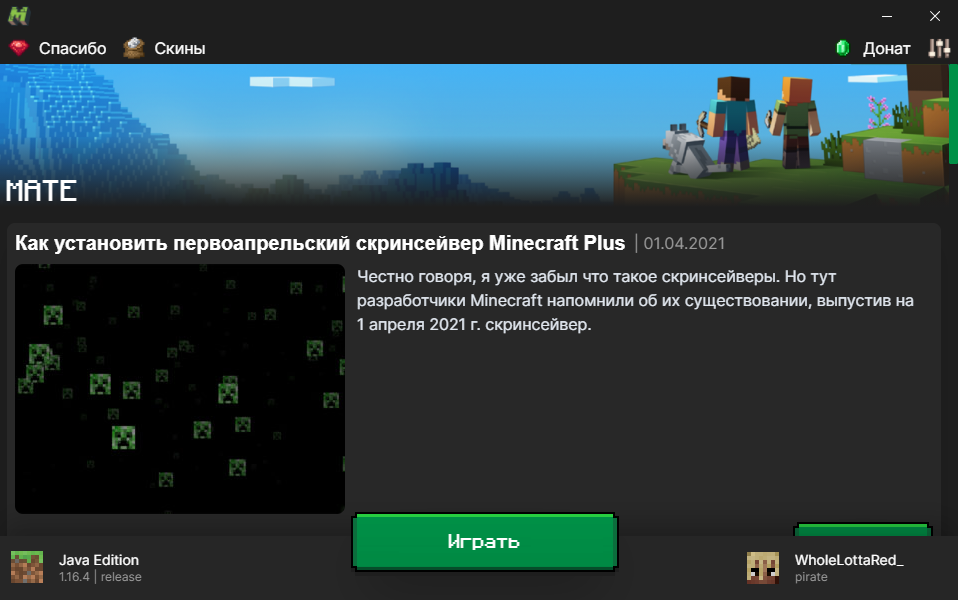

# mate-react

MATE is a Minecraft launcher which was created in May/July of 2020 and maintained back in 2021 using React

`mate-react` is a code name to it

# Start developing

1. Clone the repo and install dependencies:

```console
git clone https://github.com/matelauncher/mate-react
cd mate-react
yarn
```

2. Start MATE in dev environment:

```console
yarn start
```

# Donate to the project

If you want to donate to MATE Launcher Team go to [DonationAlerts](https://donationalerts.com/r/matelauncher)

# Roadmap

The [Roadmap](https://github.com/orgs/matelauncher/projects/1) helps MATE Launcher Team to create a great launcher!

# Credits

- [MCLC](https://github.com/Pierce01/MinecraftLauncher-Core) for awesome library to launch Minecraft
- [Ezzer29](https://github.com/Ezzer29) for giving me link to Minecraft's versions
- All awesome people that helped make i18n
